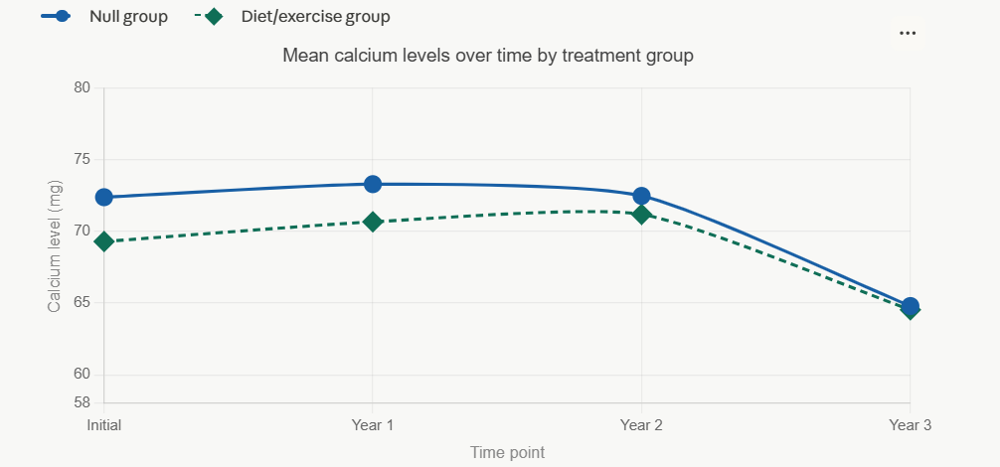
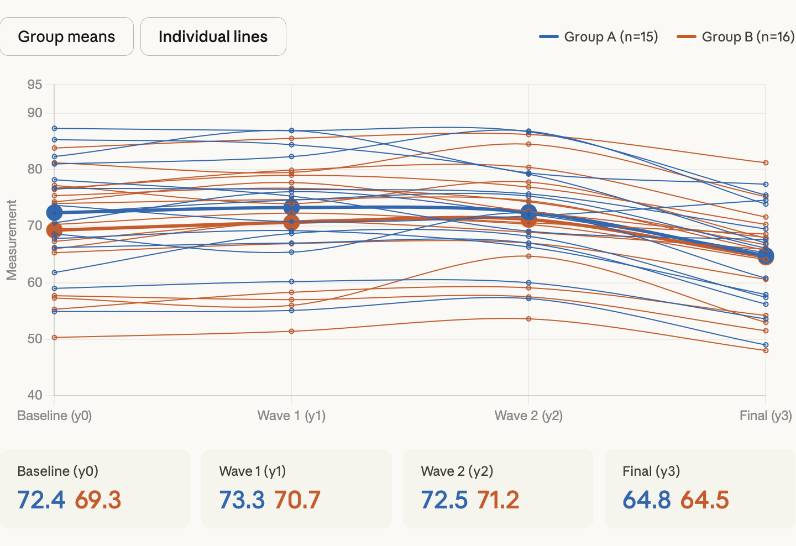

# HW #4.3: Applied Data Visualizations

## Busiest Airports Analysis
  
```{r}
#| label: tbl-airports
#| tbl-cap: "Passenger Traffic at Six Busiest Airports from 2020-2025"
#| echo: false

library(dplyr)
library(knitr)
library(tidyr)
library(ggplot2)

# Airport data sourced from Wikipedia (Publically Accessible):
# https://en.wikipedia.org/wiki/List_of_busiest_airports_by_passenger_traffic

airport <- c(
  "ATL", "ATL", "ATL", "ATL", "ATL", "ATL",
  "FRA", "FRA", "FRA", "FRA", "FRA", "FRA",
  "PKX", "PKX", "PKX", "PKX", "PKX", "PKX",
  "DXB", "DXB", "DXB", "DXB", "DXB", "DXB",
  "LAX", "LAX", "LAX", "LAX", "LAX", "LAX",
  "JFK", "JFK", "JFK", "JFK", "JFK", "JFK"
)


year <- c(
  2020, 2021, 2022, 2023, 2024, 2025,
  2020, 2021, 2022, 2023, 2024, 2025,
  2020, 2021, 2022, 2023, 2024, 2025,
  2020, 2021, 2022, 2023, 2024, 2025,
  2020, 2021, 2022, 2023, 2024, 2025,
  2020, 2021, 2022, 2023, 2024, 2025
)

passengers <- c(
  42918685, 75704760, 93699630, 104653451, 108067766, 106302208,
  18768601, 24814921, 48923474, 59359539, 61564957, 63200000,
  16091449, 25051012, 10277623, 39410776, 49441029, 53618949,
  18229461, 29110609, 66069981, 86994365, 92300000, 95200000,
  28779527, 48007284, 65924298, 75050851, 76587980, 73709594,
  16630642, 30788322, 55287711, 62464331, 63265972, 62629455
)


airport_data <- data.frame(
  Airport = airport,
  Year = year,
  Passengers = passengers
)

airport_data |>
  pivot_wider(names_from = Year, values_from = Passengers) |>
  kable()
```

```{r}
#| label: fig-busiestairports
#| fig-cap: "Passenger Traffic at Six Busiest Airports from 2020-2025"
#| echo: false
#| fig-pos: "H"

ggplot(
  data = airport_data,
  mapping = aes(
    x = year,
    y = Passengers / 1000000,,
    color = airport
  )
) +

  theme(legend.position = "bottom")+
  geom_point() +
  labs(
    title = "The Number of Passengers in Busiest Airports in 2020-2025",
    x = "Year",
    y = "Passengers (Millions)",
    color = "Airport Name"
  )
```

A connection that both the @tbl-airports and @fig-busiestairports display, tells you is the discrepancy that of passengers in 2020 compared to other years. In fact, they find that the least number of passengers for every airport from 2020 to 2025 was in 2020. This must have been primarily due to COVID and the restrictions on travel that specific year. Further visualization proof backs this claim, as in the most recent years, passenger numbers have stabilized, whereas the sharpest increase in passengers occurred from 2020 to 2021, indicating that year was an anomaly. Finally, one last connection that both the table and plot show that I've learned is that the only airport that seems to decline in population is PKX, located in Beijing, China, which happened in 2022. The reason must be primarily due to China's implemented Zero Covid policy, which had stricter travel restrictions to the country. For example, the PKX's number of passengers decreased from about 25 million to 10 million from 2021-22.

## Monte Carlo Numerical Integration

```{r}
#| label: fig-montecarlo
#| fig-cap: "Monte Carlo Numerical Integration With Varying Sample Sizes"
#| fig-pos: "H"
#| fig-subcap:
#|   - "n = 10"
#|   - "n = 100"
#|   - "n = 1,000"
#|   - "n = 10,000"
#| layout-ncol: 2
#| echo: false


library(ggplot2)

generate_points <- function(n, x_min, x_max, y_min, y_max) {
  x <- runif(n, x_min, x_max)
  y <- runif(n, y_min, y_max)
  cord_table <- data.frame(x = x, y = y)
  return(cord_table)
}

flag <- function(df){
  for (i in 1:nrow(df)){
    if (df[["y"]][i] > dnorm(df[["x"]][i])){
      df[["flag"]][i] <- "above"
    } else {
      df[["flag"]][i] <- "on/below"
    }
  }
  return(df)
}


cord_table <- generate_points(10, -4, 4, 0, 0.4)
cord_table <- flag(cord_table)
p <- mean(cord_table[["flag"]] == "on/below")
estimate <- p * (8 * 0.4)
plot10 <- ggplot(
  data = cord_table,
  mapping = aes(x = x, y = y, color = flag)
) +
  geom_point() +
  stat_function(fun = dnorm, args = list(mean = 0, sd = 1), xlim = c(-4, 4), color = "blue") +
  scale_color_manual(values = c("above" = "red", "on/below" = "green")) +
  xlim(-4, 4) + ylim(0, 0.4)

cord_table <- generate_points(100, -4, 4, 0, 0.4)
cord_table <- flag(cord_table)
p <- mean(cord_table[["flag"]] == "on/below")
estimate <- p * (8 * 0.4)
plot100 <- ggplot(
  data = cord_table,
  mapping = aes(x = x, y = y, color = flag)
) +
  geom_point() +
  stat_function(fun = dnorm, args = list(mean = 0, sd = 1), xlim = c(-4, 4), color = "blue") +
  scale_color_manual(values = c("above" = "red", "on/below" = "green")) +
  xlim(-4, 4) + ylim(0, 0.4)

cord_table <- generate_points(1000, -4, 4, 0, 0.4)
cord_table <- flag(cord_table)
p <- mean(cord_table[["flag"]] == "on/below")
estimate <- p * (8 * 0.4)
plot1000 <- ggplot(
  data = cord_table,
  mapping = aes(x = x, y = y, color = flag)
) +
  geom_point() +
  stat_function(fun = dnorm, args = list(mean = 0, sd = 1), xlim = c(-4, 4), color = "blue") +
  scale_color_manual(values = c("above" = "red", "on/below" = "green")) +
  xlim(-4, 4) + ylim(0, 0.4)

cord_table <- generate_points(10000, -4, 4, 0, 0.4)
cord_table <- flag(cord_table)
p <- mean(cord_table[["flag"]] == "on/below")
estimate <- p * (8 * 0.4)
plot10000 <- ggplot(
  data = cord_table,
  mapping = aes(x = x, y = y, color = flag)
) +
  geom_point() +
  stat_function(fun = dnorm, args = list(mean = 0, sd = 1), xlim = c(-4, 4), color = "blue") +
  scale_color_manual(values = c("above" = "red", "on/below" = "green")) +
  xlim(-4, 4) + ylim(0, 0.4)

plot10
plot100
plot1000
plot10000
```

@fig-montecarlo displays four plots with the number of points on each plot being n=10, n=100, n=1000, and n=10,000. The Monte Carlo process works by randomly generating points within a bounding box and calculating the proportion that fall under the curve, then multiplying by the total area of the box. Someone can learn as they view the small multiple is as n increases and the more area that is covered with more data points you have, estimating the area becomes closer to being more accurate. This is because with more data points, it begins to match the shape of the curve of the function.Because most of the points cover the area of the normal distribution curve, the actual integral value is about 1. 


## Planning and Prompting genAI

### Plan Informed Response

Goal: The goal here is to visualize calcium levels between woman who took treatment versus those who didn't from the initial year to year 3. 

Needs: calcium.csv, tidyverse package

Tidy this dataset calcium.csv. We are measuring calcium levels, where the null treatment group takes up the first four columns and the diet/exercise group make up the second four columns. 

Steps:

1) Split the table in half by the 5th column where the first table includes just the data for the null group. The second table 
includes just the data for the diet/exercise group. 

2) Rename the columns y0, y1, y2, y3.... to initial, year 1, year 2, and year 3 for more clarity. 

3) Add a group column on the left for both tables. For the left table fill out the column to be all "Null" and for the right table in the group column, all the cells should be filled out as "diet/exercise". 

4) Combine both tables by stacking the tables together. 

5) Change from wide to long format by including all the year's data (y0,y1,...) in 1 column called year and calcium measurements go into another column called calcium_level

6) For visualization, create distinct columns for the specific group whether they are considered to be the "null" group Create a data visualization for the dataset calcium.csv that creates a line plot that plots year on the x axis and calcium level on the y axis. Then distinguish the group type with 2 different color plots. Include an appropriate title and axes names. 


{#fig-genericPlot1 fig-alt="Line plot showing mean calcium levels over time for null and diet/exercise groups." fig-pos="H"}

## Generic Response 

Claude Generic Response Text:

Now I have all the data I need. Let me build a polished visualization as an artifact.

Here's the full tidying pipeline that was applied to calcium.csv:
Steps performed (replicating what you'd do in R/tidyverse):

Split columns 1–4 (Null group) and 5–8 (diet/exercise group) into separate tables
Renamed y0, y1, y2, y3 → initial, year 1, year 2, year 3 for both
Added a group column — "Null" for the first table, "diet/exercise" for the second
Stacked both tables with bind_rows (pandas concat)
Pivoted to long format: year and calcium_level columns
Computed group means per time point for the line plot

{#fig-genericPlot1 fig-alt="Line plot showing mean calcium levels over time for null and diet/exercise groups from generic prompt." fig-pos="H"}

{#fig-genericPlot2 fig-alt="Second plot from generic Claude response showing calcium data." fig-pos="H"}


### Narrative Text 


While all the graphs technically displayed similar results. There is a huge difference between how the data is displayed that makes it easier for an analyst to view them.The informed plot gave proper, clearer labels for the points, axes, and title and avoids over plotting. For instance, it is confusing in the generic response to know what group each plot is in. Just simply saying Group A n=15 and Group B n=16 is vague because it doesn't explicitly associate to a particular group in the situation.  Furthermore, the generic AI response added a plot summary on the bottom without an explicit request for it. This makes it harder for someone to fully understand what's happening and can add unnecessary information that may be unrelated. By tidying the data in the informed request, you can plot each individual case for a woman and represent what particular group they are in. In the informed response, they accurately labeled what line was null or diet/exercise group reflecting the actual situation and providing clarity. By providing context and ordered steps, we can get a stronger, user-preferred, related output that is much more beneficial than an output that asks the AI to make assumptions. 


## Reflection

One thing that I found helpful that I found in the course is creating visual plots using ggplot. In the industry, being able to make your points backed by properly labeled and organized visual evidence makes your point much more stronger. Learning how to use ggplot, mapping data to specific columns and updating column names to be more precise, and displaying linear trends. Furthermore, displaying plots gives me the opportunity for me to build my critical thinking skills by drawing comparisons and contrasts and question trends. For example, when analyzing why the only airport on my busiest airports graphs that had a sudden drop in passengers in 2022 was located in Beijing. It forced me to question the sudden change and I discovered it must be due to China's implemented Zero Covid Policy and their travels restrictions.



## Gen AI Usage

I used the Claude AI tool on 4/16/26 which uses the Sonnet 4.6 model by Anthropic. I provided a prompt for an informed response of a CSV dataset that outputted a visual graph. The exact response I used was "
Goal: The goal here is to visualize calcium levels between woman who took treatment versus those who didn't from the initial year to year 3. 

Needs: calcium.csv, tidyverse package

Tidy this dataset calcium.csv. We are measuring calcium levels, where the null treatment group takes up the first four columns and the diet/exercise group make up the second four columns. 

Steps:

1) Split the table in half by the 5th column where the first table includes just the data for the null group. The second table 
includes just the data for the diet/exercise group. 

2) Rename the columns y0, y1, y2, y3.... to initial, year 1, year 2, and year 3 for more clarity. 

3) Add a group column on the left for both tables. For the left table fill out the column to be all "Null" and for the right table in the group column, all the cells should be filled out as "diet/exercise". 

4) Combine both tables by stacking the tables together. 

5) Change from wide to long format by including all the year's data (y0,y1,...) in 1 column called year and calcium measurements go into another column called calcium_level

6) For visualization, create distinct columns for the specific group whether they are considered to be the "null" group Create a data visualization for the dataset calcium.csv that creates a line plot that plots year on the x axis and calcium level on the y axis. Then distinguish the group type with 2 different color plots. Include an appropriate title and axes names." 
The exact response I received from Claude was:

Now I have all the data I need. Let me build a polished visualization as an artifact.

Here's the full tidying pipeline that was applied to calcium.csv:
Steps performed (replicating what you'd do in R/tidyverse):

Split columns 1–4 (Null group) and 5–8 (diet/exercise group) into separate tables
Renamed y0, y1, y2, y3 → initial, year 1, year 2, year 3 for both
Added a group column — "Null" for the first table, "diet/exercise" for the second
Stacked both tables with bind_rows (pandas concat)
Pivoted to long format: year and calcium_level columns
Computed group means per time point for the line plot

{#fig-genericPlot1 fig-alt="Line plot showing mean calcium levels over time for null and diet/exercise groups." fig-pos="H"}




## Code Appendix

```{r}
#| echo: true
#| eval: false

library(dplyr)
library(knitr)
library(tidyr)
library(ggplot2)

airport <- c(
  "ATL", "ATL", "ATL", "ATL", "ATL", "ATL",
  "FRA", "FRA", "FRA", "FRA", "FRA", "FRA",
  "PKX", "PKX", "PKX", "PKX", "PKX", "PKX",
  "DXB", "DXB", "DXB", "DXB", "DXB", "DXB",
  "LAX", "LAX", "LAX", "LAX", "LAX", "LAX",
  "JFK", "JFK", "JFK", "JFK", "JFK", "JFK"
)

year <- c(
  2020, 2021, 2022, 2023, 2024, 2025,
  2020, 2021, 2022, 2023, 2024, 2025,
  2020, 2021, 2022, 2023, 2024, 2025,
  2020, 2021, 2022, 2023, 2024, 2025,
  2020, 2021, 2022, 2023, 2024, 2025,
  2020, 2021, 2022, 2023, 2024, 2025
)

passengers <- c(
  42918685, 75704760, 93699630, 104653451, 108067766, 106302208,
  18768601, 24814921, 48923474, 59359539, 61564957, 63200000,
  16091449, 25051012, 10277623, 39410776, 49441029, 53618949,
  18229461, 29110609, 66069981, 86994365, 92300000, 95200000,
  28779527, 48007284, 65924298, 75050851, 76587980, 73709594,
  16630642, 30788322, 55287711, 62464331, 63265972, 62629455
)

airport_data <- data.frame(
  Airport = airport,
  Year = year,
  Passengers = passengers
)

airport_data |>
  pivot_wider(names_from = Year, values_from = Passengers) |>
  kable()

ggplot(
  data = airport_data,
  mapping = aes(
    x = Year,
    y = Passengers / 1000000,
    color = Airport
  )
) +
  theme(legend.position = "bottom") +
  geom_point() +
  labs(
    title = "The Number of Passengers in Busiest Airports from 2020-2025",
    x = "Year",
    y = "Passengers (Millions)",
    color = "Airport Name"
  )

generate_points <- function(n, x_min, x_max, y_min, y_max) {
  x <- runif(n, x_min, x_max)
  y <- runif(n, y_min, y_max)
  cord_table <- data.frame(x = x, y = y)
  return(cord_table)
}

flag <- function(df){
  for (i in 1:nrow(df)){
    if (df[["y"]][i] > dnorm(df[["x"]][i])){
      df[["flag"]][i] <- "above"
    } else {
      df[["flag"]][i] <- "on/below"
    }
  }
  return(df)
}

cord_table <- generate_points(10, -4, 4, 0, 0.4)
cord_table <- flag(cord_table)
plot10 <- ggplot(
  data = cord_table,
  mapping = aes(x = x, y = y, color = flag)
) +
  geom_point() +
  stat_function(fun = dnorm, args = list(mean = 0, sd = 1), xlim = c(-4, 4), color = "blue") +
  scale_color_manual(values = c("above" = "red", "on/below" = "green")) +
  xlim(-4, 4) + ylim(0, 0.4)

cord_table <- generate_points(100, -4, 4, 0, 0.4)
cord_table <- flag(cord_table)
plot100 <- ggplot(
  data = cord_table,
  mapping = aes(x = x, y = y, color = flag)
) +
  geom_point() +
  stat_function(fun = dnorm, args = list(mean = 0, sd = 1), xlim = c(-4, 4), color = "blue") +
  scale_color_manual(values = c("above" = "red", "on/below" = "green")) +
  xlim(-4, 4) + ylim(0, 0.4)

cord_table <- generate_points(1000, -4, 4, 0, 0.4)
cord_table <- flag(cord_table)
plot1000 <- ggplot(
  data = cord_table,
  mapping = aes(x = x, y = y, color = flag)
) +
  geom_point() +
  stat_function(fun = dnorm, args = list(mean = 0, sd = 1), xlim = c(-4, 4), color = "blue") +
  scale_color_manual(values = c("above" = "red", "on/below" = "green")) +
  xlim(-4, 4) + ylim(0, 0.4)

cord_table <- generate_points(10000, -4, 4, 0, 0.4)
cord_table <- flag(cord_table)
plot10000 <- ggplot(
  data = cord_table,
  mapping = aes(x = x, y = y, color = flag)
) +
  geom_point() +
  stat_function(fun = dnorm, args = list(mean = 0, sd = 1), xlim = c(-4, 4), color = "blue") +
  scale_color_manual(values = c("above" = "red", "on/below" = "green")) +
  xlim(-4, 4) + ylim(0, 0.4)

plot10
plot100
plot1000
plot10000

```

